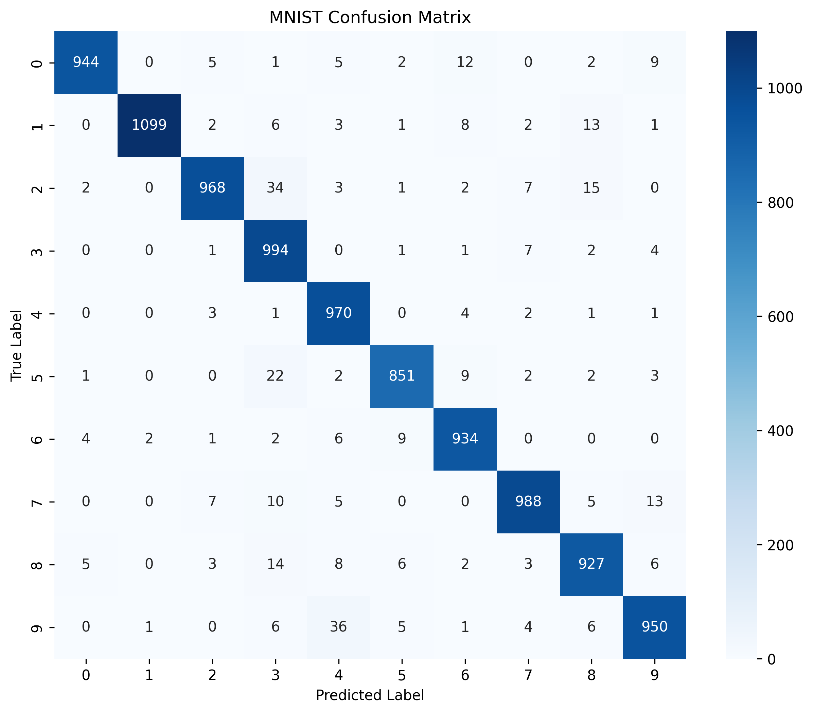

# MNIST Handwritten Digit Classification 🧠🔢

A deep learning project that classifies handwritten digits from the MNIST dataset using a neural network built with TensorFlow/Keras.

## 📌 Project Overview

The goal of this project is to teach a neural network to recognize handwritten digits from **0 to 9**.

Each MNIST image is a grayscale image of size **28 × 28 pixels**.

The basic workflow of the project is:

Image → Pixel Values → Preprocessing → Neural Network → Prediction → Evaluation

---

## 📊 Dataset

The project uses the **MNIST handwritten digit dataset**.

The dataset contains:

- **60,000 training images**
- **10,000 test images**
- Image size: **28 × 28 pixels**
- Number of classes: **10**
- Classes: **0, 1, 2, 3, 4, 5, 6, 7, 8, 9**

Each pixel contains an intensity value from **0 to 255**.

The pixel values are normalized to a range of **0 to 1** before training.

---

## 🧠 Model Architecture

The neural network contains the following layers:

```text
Input Image
    ↓
28 × 28 pixels
    ↓
Flatten
    ↓
784 input values
    ↓
Dense Layer — 50 neurons + ReLU
    ↓
Dense Layer — 50 neurons + ReLU
    ↓
Output Layer — 10 neurons
    ↓
Predicted Digit (0–9)

MNIST-Digit-Classification/
│
├── 📄 README.md
├── 📓 MNIST_Digit_Classification.ipynb
├── 🤖 mnist_digit_classifier.keras
└── 🖼️ confusion_matrix.png

## 📊 Confusion Matrix

The confusion matrix shows how well the model classified each digit from 0 to 9.



## 👨‍💻 Author

**mariyam-code07**

Computer Science Engineering — AI & Machine Learning

